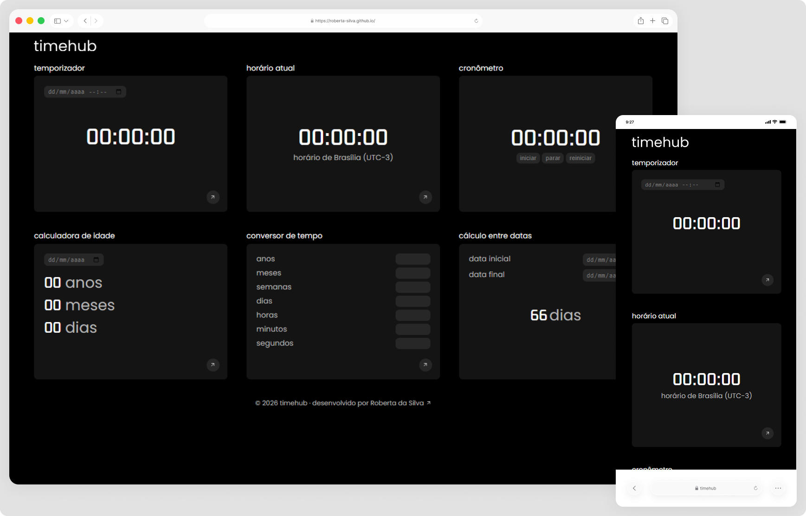

# TimeHub ✨

TimeHub é uma aplicação web em desenvolvimento que reúne diversas ferramentas relacionadas a tempo e datas em um único lugar. O projeto foi idealizado para praticar e consolidar conceitos de HTML, CSS e JavaScript, com foco em organização de código, reutilização de componentes e construção de interfaces funcionais e intuitivas.

> Status do projeto: Em desenvolvimento ⌛

## Acesse o projeto

🔗 [https://roberta-silva.github.io/timehub/](https://roberta-silva.github.io/timehub/)  

## Funcionalidades
- Temporizador  
- Cronômetro  
- Exibição da hora atual  
- Calculadora de idade  
- Cálculo de diferença entre datas  
- Conversor de tempo  

## Objetivos técnicos
- Estruturação semântica do HTML5  
- Organização e reutilização de estilos em CSS  
- Criação de interfaces funcionais e intuitivas  
- Manipulação do DOM com JavaScript  
- Aplicação de lógica para cálculos de tempo e datas  
- Evolução contínua do projeto com novas funcionalidades  

## Tecnologias
- HTML5  
- CSS3  
- JavaScript (ES6+)  

## 👀 Preview

